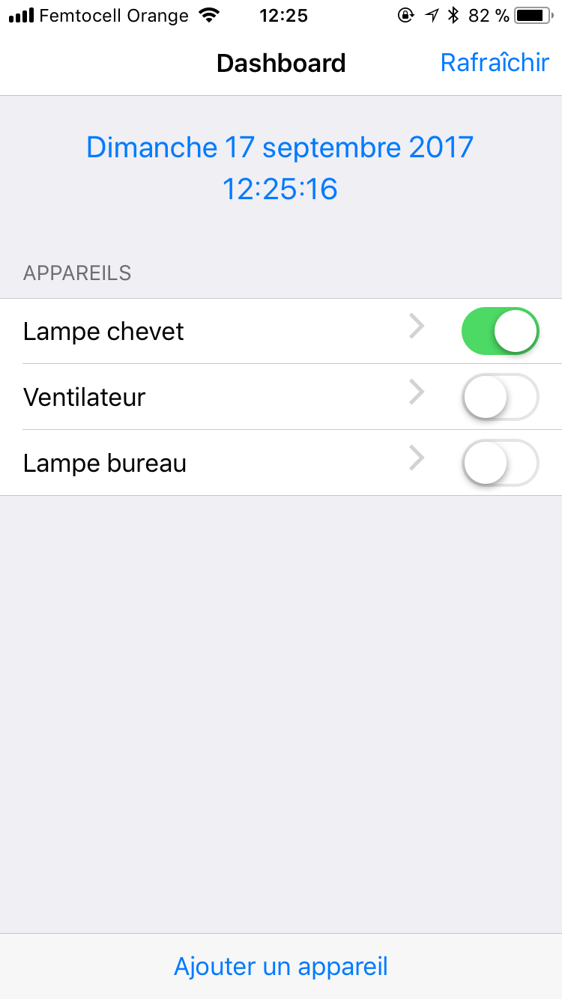
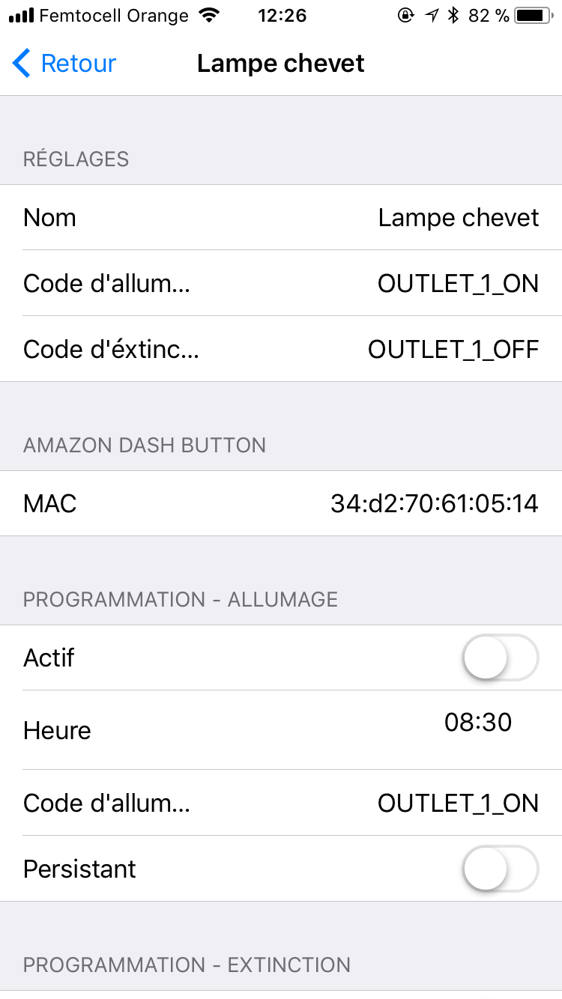

# Raspberry Pi Dashboard

Dashboard for a home automation system.

### Requirements

* `apache2`, `MySQL`, `PHP`
* `ntpdate`
* `www-data` must have sudo access to `ntpdate`, without password[1](#root_access)

### Credits
* http://framework7.io/ - iOS like HTML Framework

---

<a name="root_access">1</a>: Run `sudo visudo` and add `www-data ALL=(ALL) NOPASSWD:/usr/sbin/ntpdate` at the end of the file.
